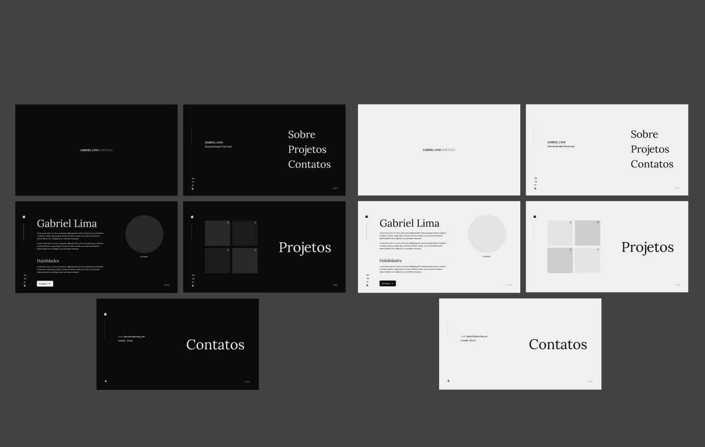

# Meu Portfólio

<div align="center">
  
</div>

<p align="center"><a href="https://gabriellima-frontend.vercel.app">Acesse aqui</a></p>

# Tecnologias

- [NextJS](https://nextjs.org/)
- [Typescript](https://www.typescriptlang.org/)
- [Hygraph](https://hygraph.com/)
- [TailwindCSS](https://tailwindcss.com/)
- [Framer-Motion](https://www.framer.com/motion/)

# Rodando o projeto:

<small><strong>OBS: </strong>Os projetos são consumidos de uma API privada criada no [Hygraph](https://hygraph.com), onde adicionei meus projetos. Você pode fazer o mesmo, basta criar uma conta e adicionar seus projetos.</small>

Você precisa ter o [Node](https://nodejs.org/en/), o [Git](https://git-scm.com/) e algum gerenciador de pacotes([NPM](https://docs.npmjs.com/downloading-and-installing-node-js-and-npm/) | [Yarn](https://classic.yarnpkg.com/lang/en/docs/install)) instalados em sua máquina.

```bash
1. Clone o repositório:
$ git clone https://github.com/gabriellima2/my-portfolio.git

2. Acesse a pasta e instale as dependências via terminal:
$ yarn / npm install
```

Crie uma conta no [Hygraph](https://hygraph.com/), [clone o projeto](https://app.hygraph.com/clone/c4b4fea0e20d426b926807a97621ea09?name=my-portfolio) e adicione suas Skills e Projetos.

```bash
3. Adicione as variáveis de ambiente:

.env.local

// Sua API no Hygraph
NEXT_PUBLIC_API_TOKEN=Seu Token de autenticação.
NEXT_PUBLIC_API_URL=URL da sua API.

NEXT_PUBLIC_GITHUB_USER=Seu usuário no Github.
```

Agora basta rodar o projeto:

```bash
4. Inicie a aplicação em modo de desenvolvimento:
$ yarn dev / npm run dev

5. O servidor será aberto em http://localhost:3000
```

<p align="center">Projeto feito com 💙 por <a href="https://www.linkedin.com/in/gabriel-lima-860612236">Gabriel Lima</a></p>
