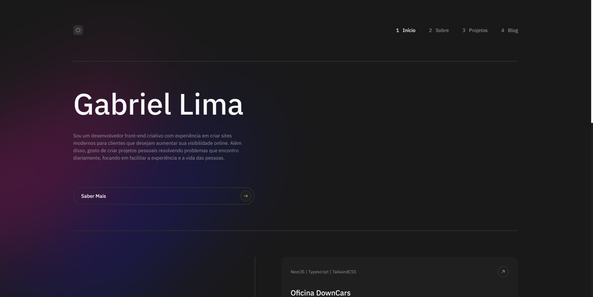
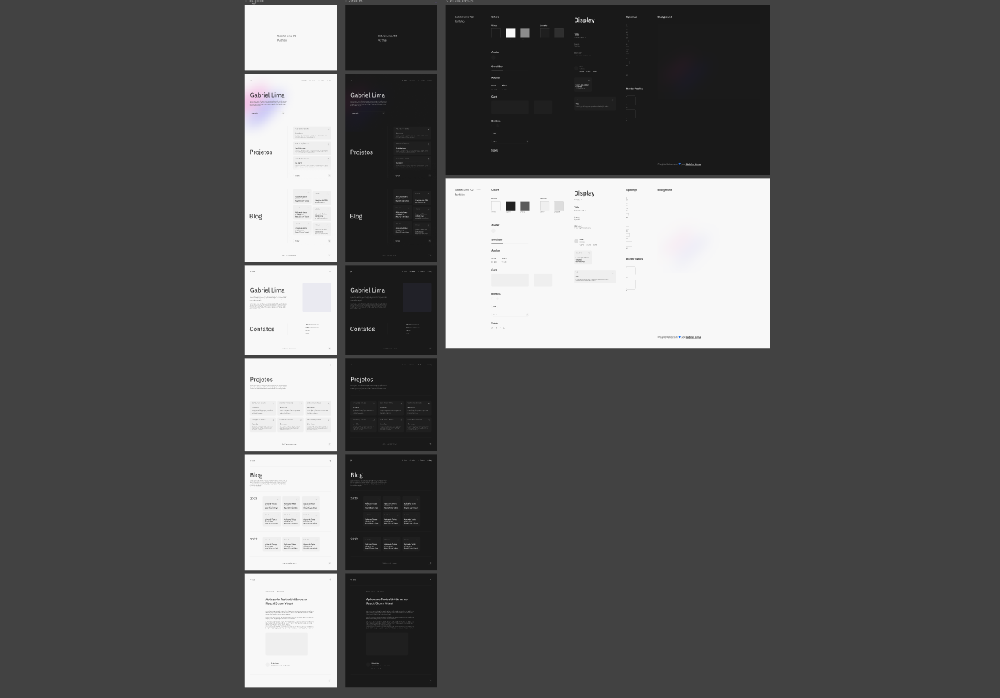

# Portfólio v3

<div align="center">
  
</div>

<p align="center"><a href="https://gabrielrslima.vercel.app/">Acessar Projeto</a></p>

# Tecnologias

- [NextJS](https://nextjs.org/)
- [Typescript](https://www.typescriptlang.org/)
- [TailwindCSS](https://tailwindcss.com/)
- [Jest](https://jestjs.io/pt-BR/)
- [Testing Library](https://testing-library.com/docs/)
- [Hygraph](https://hygraph.com/)
- [GraphQL](https://graphql.org/)
- [Apollo Client](https://www.apollographql.com/docs/react/)
- [Storybook](https://storybook.js.org/)

# Prototipagem

<div align="center">
  
</div>

<h4 align="center">Feito com <a href="https://www.figma.com/">Figma</a></h4>

# Rodando o projeto

<small><strong>OBS: </strong>Os projetos são consumidos de uma API criada no [Hygraph](https://hygraph.com). Você pode fazer o mesmo, basta criar uma conta, [clonar a API](https://app.hygraph.com/clone/708e2f1712bc41a3b006ee61beffddee?name=Portfolio) e adicionar os seus projetos.</small>

Você precisa ter o [Node](https://nodejs.org/en/), o [Git](https://git-scm.com/) e algum gerenciador de pacotes([NPM](https://docs.npmjs.com/downloading-and-installing-node-js-and-npm/) | [Yarn](https://classic.yarnpkg.com/lang/en/docs/install)) instalados em sua máquina.

```bash
1. Clone o repositório:
$ git clone https://github.com/gabriellima2/my-portfolio.git

2. Adicione as credenciais para sua API do Hygraph em um arquivo .env.local
.env.local
NEXT_PUBLIC_API_TOKEN=Token de autenticação.
NEXT_PUBLIC_API_URL=URL da API.

3. Acesse a pasta e instale as dependências via terminal:
$ yarn || npm i

4. Inicie a aplicação em modo de desenvolvimento:
$ yarn dev || npm run dev

5. O servidor será aberto em http://localhost:3000
```


<p align="center">Projeto feito com 💙 por <a href="https://www.linkedin.com/in/gabriel-lima-860612236">Gabriel Lima</a></p>
